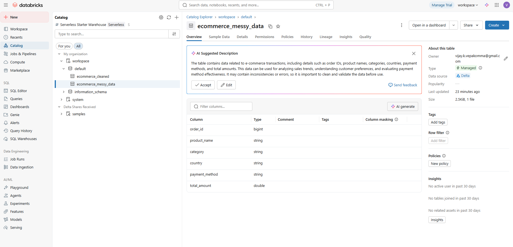
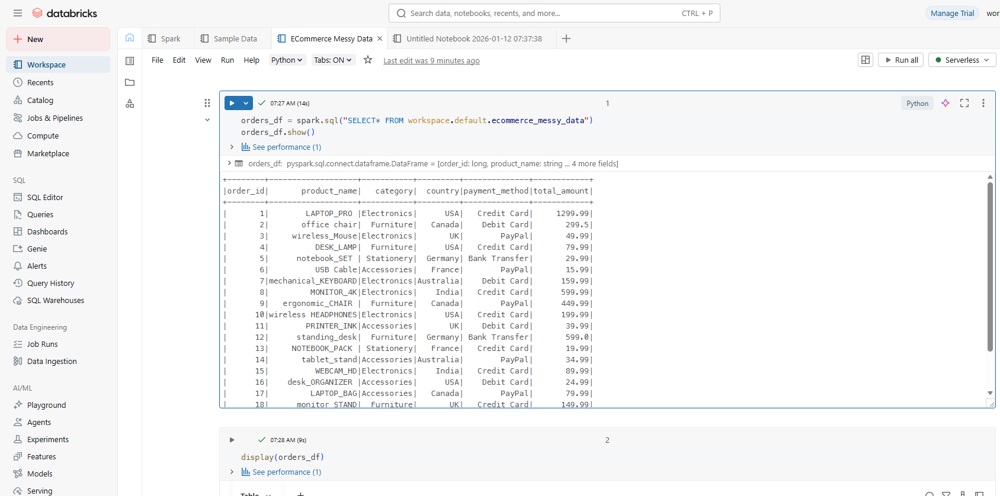
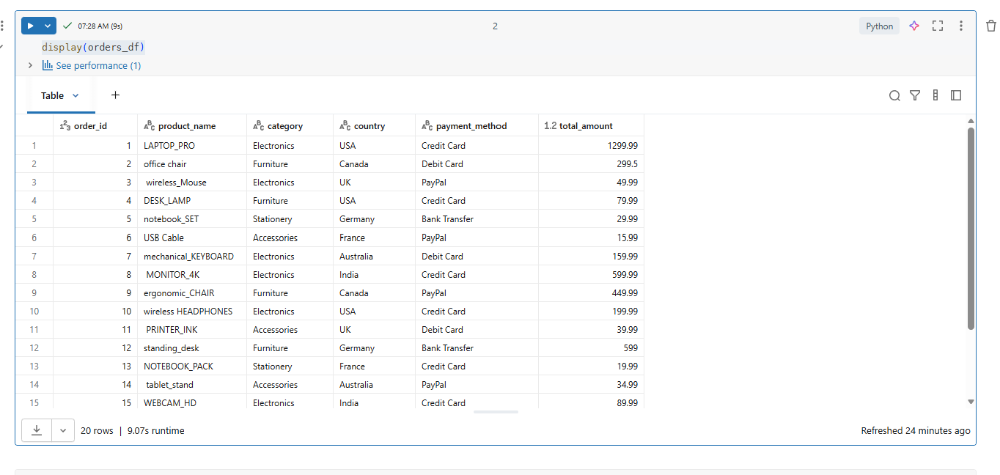
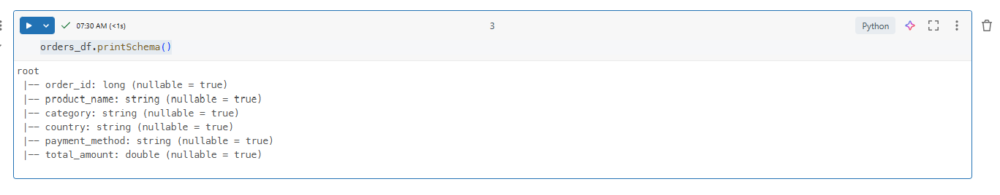
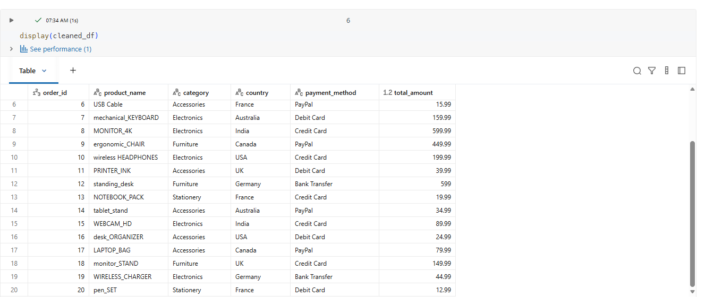

# Analyze Custom Data

## Add our Data

- Data Engineering ->  Data Ingestion
- Upload File


## View Our Data

- Catalog 
- workspace -> default -> your table (called "Delta Table")



## Analyze Our Data

- Workspace / Notebooks



### Query Data

```python
orders_df = spark.sql("SELECT* FROM workspace.default.ecommerce_messy_data")
orders_df.show()

```

### Native Analysis (Like Excel)

```python
display(orders_df)
```




### Count

```python
orders_df.count()
```

### Schema

```python
orders_df.printSchema()
```



## Transform Our Data

```python
from pyspark.sql.functions import trim, col

cleaned_df = orders_df.withColumn("product_name", trim(col("product_name")))

cleaned_df.count()
cleaned_df.show()
```


```python
cleaned_df.write.mode("overwrite").format("delta").saveAsTable("ecommerce_cleaned")
```


## Compare Tables

NOTE: We can use AI button to generate comparison query (or any other query)

```python
from pyspark.sql.functions import length

orders_length_df = orders_df.select("order_id", "product_name", length(col("product_name")).alias("original_length"))
cleaned_length_df = cleaned_df.select("order_id", "product_name", length(col("product_name")).alias("cleaned_length"))

comparison_df = orders_length_df.join(
    cleaned_length_df,
    on="order_id",
    how="inner"
).select(
    orders_length_df["order_id"],
    orders_length_df["product_name"].alias("original_product_name"),
    orders_length_df["original_length"],
    cleaned_length_df["product_name"].alias("cleaned_product_name"),
    cleaned_length_df["cleaned_length"]
)

display(comparison_df)
```
