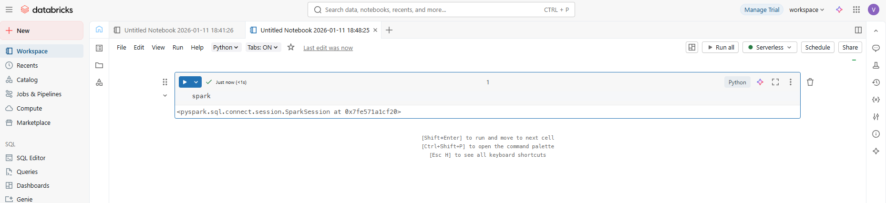
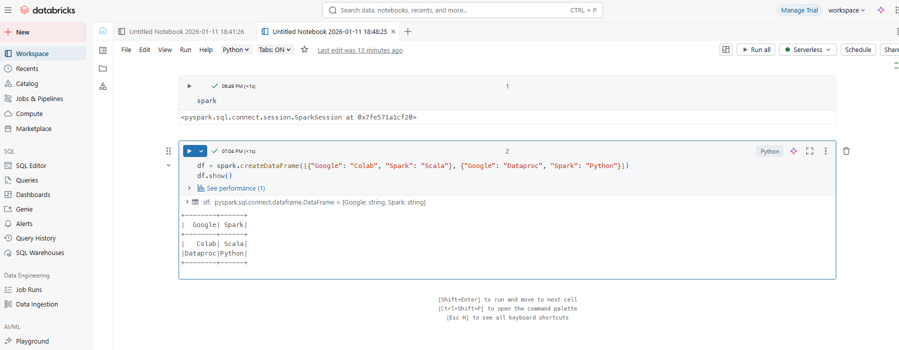

# Delta Lake Data Bricks

- Sign Up with your Google 
- [My Databricks](https://dbc-c59e6aef-de8a.cloud.databricks.com/?o=7474649364858640)


## Quick Start 

- New -> Notebook

```python
spark
```



```python
df = spark.createDataFrame(
    [{"Google": "Colab", "Spark": "Scala"}, {"Google": "Dataproc", "Spark": "Python"}]
)
df.show()

```

